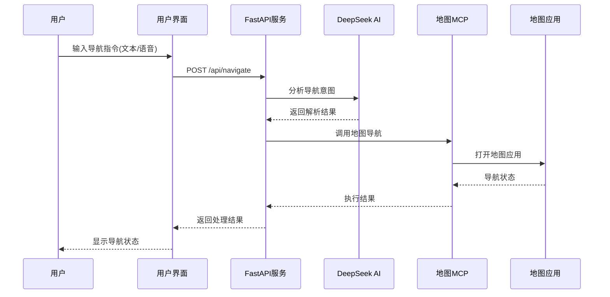

# AI导航助手 - 架构设计文档

## 系统概述

AI导航助手是一个基于MCP（Model Context Protocol）的智能导航系统，通过AI分析用户意图，自动调用地图服务进行导航。系统支持语音和文本输入，能够智能选择合适的地图服务并执行导航操作。

## 架构设计

### 整体架构图

```
┌─────────────────┐    ┌──────────────────┐    ┌─────────────────┐
│   用户界面层     │    │    服务层        │    │    AI服务层     │
│                 │    │                  │    │                 │
│  • Web前端      │◄──►│  • FastAPI服务   │◄──►│  • DeepSeek API │
│  • 语音输入     │    │  • 业务逻辑      │    │  • 意图识别     │
│  • 文本输入     │    │  • 路由管理      │    │  • 地址标准化   │
└─────────────────┘    └──────────────────┘    └─────────────────┘
                                │
                                ▼
┌─────────────────┐    ┌──────────────────┐    ┌─────────────────┐
│   执行层        │    │    地图服务      │    │   外部应用      │
│                 │    │                  │    │                 │
│  • 地图MCP客户端 │◄──►│  • 百度地图MCP   │◄──►│  • 百度地图     │
│  • 服务选择器   │    │  • 高德地图MCP   │    │  • 高德地图     │
└─────────────────┘    └──────────────────┘    └─────────────────┘
```

### 核心组件说明

#### 1. 用户界面层 (UI Layer)
- **技术栈**: HTML5, CSS3, JavaScript
- **功能**:
  - 提供友好的Web交互界面
  - 支持文本输入框
  - 集成语音录制功能
  - 实时显示处理结果和系统状态

#### 2. 服务层 (Service Layer)
- **技术栈**: FastAPI, Uvicorn
- **核心模块**:
  - `main.py`: 应用入口，路由定义
  - `navigation_service.py`: 核心业务逻辑
  - API端点:
    - `/api/navigate`: 处理导航请求
    - `/api/status`: 系统状态检查
    - `/api/voice/*`: 语音处理相关

#### 3. AI服务层 (AI Service Layer)
- **技术栈**: DeepSeek API
- **核心模块**: `deepseek_service.py`
- **功能**:
  - 意图识别: 分析用户输入，提取起点、终点
  - 地址标准化: 验证和标准化地理地址
  - 服务选择: 推荐使用的地图服务

#### 4. 执行层 (Execution Layer)
- **技术栈**: MCP客户端
- **核心模块**: `map_mcp_service.py`
- **功能**:
  - 百度地图MCP客户端
  - 高德地图MCP客户端
  - 统一的服务调用接口

## 数据流设计

### 导航请求处理流程



### 核心数据结构

#### 导航意图解析结果
```python
{
    "origin": "起点地址",
    "destination": "终点地址",
    "map_service": "baidu_map|amap",
    "transport_mode": "transit|driving|walking",
    "confidence": 0.95
}
```

#### 导航执行结果
```python
{
    "success": True|False,
    "user_input": "原始输入",
    "intent_analysis": {...},
    "address_validation": {...},
    "navigation_execution": {...},
    "summary": {
        "origin": "标准化起点",
        "destination": "标准化终点",
        "map_service": "使用的地图服务",
        "transport_mode": "交通方式"
    }
}
```

## 技术选型说明

### 为什么选择Python？

1. **丰富的MCP支持**: Python有成熟的MCP客户端库
2. **语音处理能力**: SpeechRecognition + PyAudio组合成熟
3. **Web开发便捷**: FastAPI提供高性能API开发
4. **AI集成简单**: 丰富的AI API客户端库
5. **跨平台兼容**: 支持Windows, macOS, Linux

### MCP配置参考文档

#### 百度地图MCP
- **官方文档**: https://lbs.baidu.com/faq/api?title=mcpserver/quickstart
- **主要工具**:
  - `open_navigation`: 打开导航
  - `search_place`: 搜索地点
- **URL格式**: `https://mcp.map.baidu.com/mcp?ak=YOUR_AK`

#### 高德地图MCP
- **官方文档**: https://lbs.amap.com/api/mcp-server/gettingstarted
- **主要工具**:
  - `open_navigation`: 打开导航
  - `search_place`: 搜索地点
- **URL格式**: `https://mcp.amap.com/sse?key=YOUR_KEY`

#### DeepSeek API
- **官方文档**: https://api-docs.deepseek.com/zh-cn/
- **主要接口**: `/chat/completions`
- **模型**: `deepseek-chat`

## 配置管理

### 环境变量配置
系统使用`.env`文件管理敏感配置：

```env
# DeepSeek API配置
DEEPSEEK_API_KEY=your_deepseek_api_key
DEEPSEEK_BASE_URL=https://api.deepseek.com

# 百度地图配置
BAIDU_MAP_AK=your_baidu_ak

# 高德地图配置
AMAP_KEY=your_amap_key

# 应用配置
APP_HOST=127.0.0.1
APP_PORT=8000
```

### API密钥获取

1. **DeepSeek API**:
   - 访问: https://platform.deepseek.com/
   - 注册账号并获取API密钥

2. **百度地图AK**:
   - 访问: https://lbsyun.baidu.com/
   - 创建应用并获取AK

3. **高德地图Key**:
   - 访问: https://lbs.amap.com/
   - 创建应用并获取Key

## 扩展性设计

### 插件化架构
系统采用插件化设计，便于扩展新的地图服务：

1. **新增地图服务**: 继承`MapMCPClient`基类
2. **注册服务**: 在`MapMCPService`中注册新客户端
3. **配置更新**: 添加对应的环境变量配置

### AI服务可替换
DeepSeek服务可以替换为其他AI服务，只需实现相同的接口即可。

## 安全考虑

1. **API密钥保护**: 环境变量管理，不硬编码
2. **输入验证**: 对用户输入进行验证和清理
3. **错误处理**: 完善的异常处理和日志记录
4. **CORS配置**: 前端API调用的跨域安全

## 性能优化

1. **异步处理**: 使用async/await提高并发性能
2. **连接复用**: HTTP连接池管理
3. **缓存策略**: 对频繁查询的地址进行缓存
4. **超时控制**: 设置合理的API调用超时

## 部署方案

### 开发环境
```bash
python main.py
```

### 生产环境
```bash
uvicorn main:app --host 0.0.0.0 --port 8000 --workers 4
```

### Docker部署
提供Dockerfile支持容器化部署。

## 监控和日志

- **系统状态监控**: `/api/status`端点
- **请求日志**: 记录所有导航请求和处理结果
- **错误日志**: 详细的异常信息和堆栈跟踪
- **性能指标**: API响应时间、成功率等